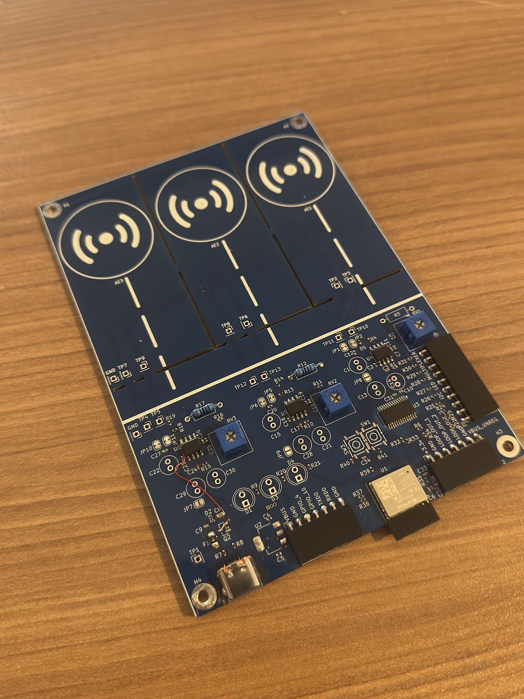
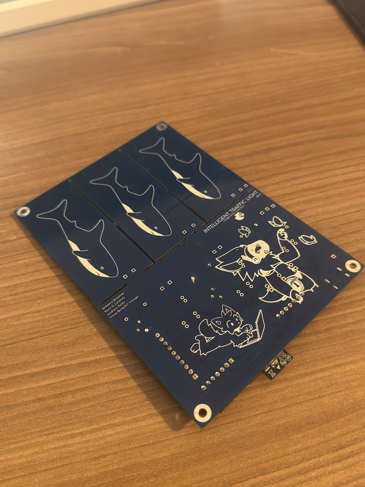
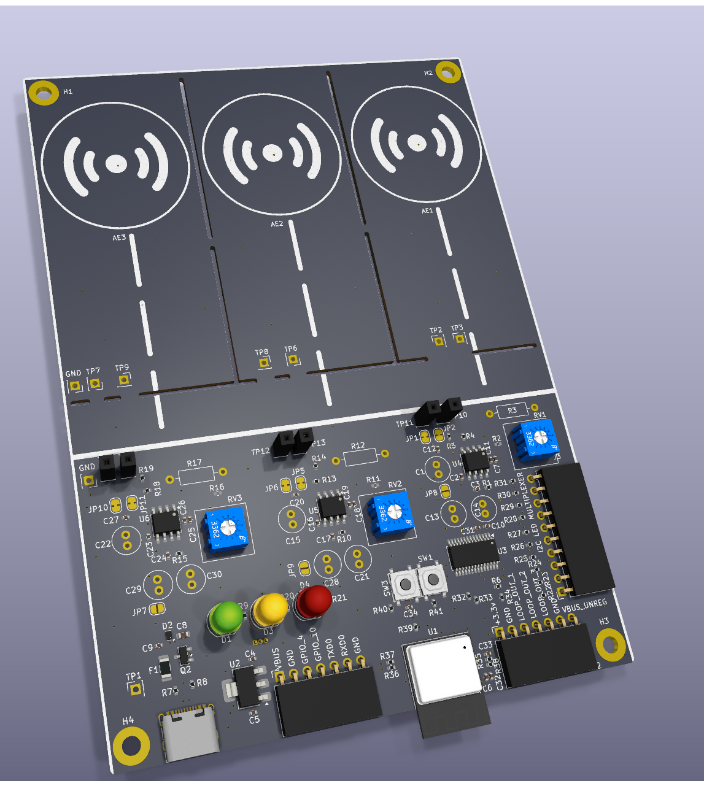

# Intelligent-Traffic-Simulator

> [!NOTE]
> Detect how hot wheels cars navigate streets and interact with stop lights and how this can be applied to the real world. Just a thing I made for class

It detects hot wheels cars via the three coils embedded in the PCB traces. The coils are hooked up to a 555 timer at around 200 KHz and when the hot wheels car is over the coil, the frequency changes which is detected by the ESP32 running a pulse counter script. Essentially a metal/object detector specifically calibrated for hot wheels cars.

Potentiometers are just for debugging / testing out various configurations. There is a multiplexer hooked up to the ESP32 so that one microcontroller can control multiple LEDs for multiple traffic lights.

I made some small mistakes, but I believe I updated the schematic to reflect the changes I made to make it work.

### Todo: 
* better ESD/current backflow protection 
* have esp32 fully inside PCB outline rather than sticking out
* remove extra testpoints / optvbvvcional components now that I know what works
* look into using a general oscillator rather than a 555 timer for better performance/cost
* somehow make the usb-c connector much easier to solder, it's killing me how difficult it is
* integrate `object-detection.ino` with `dutch_traffic_light_code.ino`

## Media

  
  

### KiCad PCB & Schematic

    

